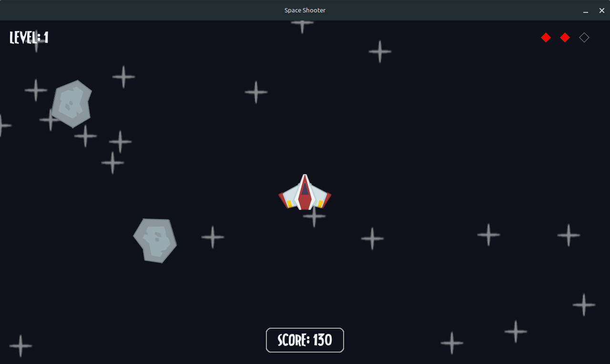
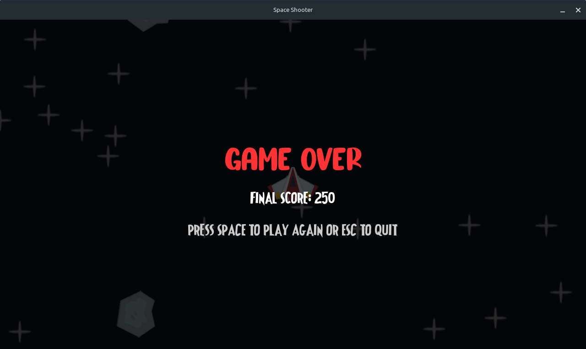

# Space Shooter

A 2D space-themed arcade shooter developed with Python and Pygame where players control a spaceship to destroy falling
meteors while avoiding collisions.

## Screenshots

<div align="center" style="display: flex; justify-content: space-evenly; width: 100%;">
  
  
</div>

## Game Overview

In Space Shooter, you control a spaceship that can move in all directions within the game window. The objective is to
survive as long as possible while shooting down meteors that fall from the top of the screen. The game features a
progressive difficulty system, where both meteor spawn rates and player shooting capabilities change as you advance
through levels.

### Controls

-   **W, A, S, D**: Move the spacecraft (up, left, down, right)
-   **Space**: Fire lasers
-   **ESC**: Quit game (during game over screen)
-   **Space**: Restart game (during game over screen)

## Features

### Core Mechanics

-   Fluid spaceship movement with normalized diagonal speed
-   Physics-based meteor behavior with rotation and drift
-   Pixel-perfect collision detection
-   Delta-time movement for consistent gameplay across different hardware

### Game Systems

-   **Progressive Difficulty**: Meteor spawn rate increases and firing cooldown changes with level progression
-   **Lives System**: Player has three lives before game over
-   **Scoring System**: Points awarded for surviving and destroying meteors
-   **Level System**: Automatically advances based on score thresholds
-   **Visual Feedback**: Animation systems for explosions and UI elements

### Technical Elements

-   Sprite-based game architecture
-   Sound and music integration
-   Asset management system with error handling
-   Optimized performance with sprite groups
-   Comprehensive state management

## Development Journey

This project was initially developed while following Clear Code's Python game development
tutorial, ["Master Python by making 5 games [the new ultimate introduction to pygame]"](https://www.youtube.com/watch?v=8OMghdHP-zs).
The tutorial provided essential groundwork for understanding Pygame's structure and functionality.

### Learning Process

Through the development of this game, I gained hands-on experience with:

1. **Pygame Fundamentals**:

    - Event handling and game loops
    - Surface and sprite management
    - Rendering and blitting techniques

2. **Object-Oriented Programming in Games**:

    - Class hierarchy for game objects
    - Inheritance patterns for sprites
    - Component-based design principles

3. **Game Development Concepts**:

    - Frame-independent movement using delta time
    - Collision detection algorithms
    - Game state management
    - Asset pipeline and resource management

4. **Software Development Practices**:
    - Code organization and modularity
    - Documentation and commenting
    - Debugging techniques

### Personal Extensions

After completing the tutorial's basic implementation, I extended the project with several features to deepen my
understanding and create a more complete game:

#### Gameplay Additions

-   Implemented a tiered scoring system that rewards both survival time and active gameplay
-   Designed a progressive level system with appropriate difficulty scaling
-   Added a lives/heart system with visual representation
-   Created adaptive difficulty through dynamic spawn rates and cooldown times

#### Technical Improvements

-   Restructured the codebase for better maintainability and readability
-   Added comprehensive error handling for asset loading
-   Implemented a proper game state machine for menu/gameplay transitions
-   Enhanced the visual feedback systems with animations and UI elements

## Project Structure

```
space-shooter/
├── main.py              # Main game file
├── images/              # Game assets directory
│   ├── explosion/       # Explosion animation frames
│   ├── player.png       # Player spaceship sprite
│   ├── meteor.png       # Meteor enemy sprite
│   ├── laser.png        # Laser projectile sprite
│   ├── star.png         # Background decoration
│   ├── gameOver.png     # Laser projectile sprite
│   ├── gamePlay.png     # Background decoration
│   ├── Frank.ttf        # Game Font
│   └── GameBuble.otf    # Game Over font
├── audio/               # Audio assets directory
│   ├── laser.wav        # Laser sound effect
│   ├── explosion.wav    # Explosion sound effect
│   ├── damage.ogg       # Player damage sound
│   ├── game_over.wav    # Game over sound
│   └── game_music.wav   # Background music
└── README.md            # Project documentation
```

## Getting Started

### Prerequisites

-   Python 3.7 or higher
-   Pygame Community Edition 2.5 or higher

### Installation

1. Clone the repository:

```bash
git clone https://github.com/Yokaiiiii/space-shooter.git
cd space-shooter
```

2. Install Pygame:

```bash
pip install pygame-ce
```

3. Run the game:

```bash
python3 main.py
```

## Credits

-   Original tutorial and game Resources by Clear
    Code: [Master Python by making 5 games](https://www.youtube.com/watch?v=8OMghdHP-zs)
-   Game Over Sound effect from [mixkit.co](https://mixkit.co/free-sound-effects/game/)
-   Font: Frank and Game Buble from [FontSpace.com](https://www.fontspace.com)
